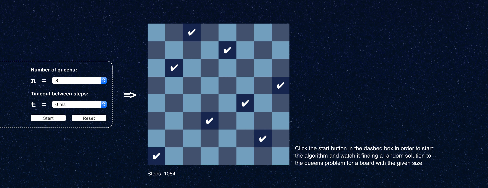

#Generating a random solution to the n-queens problem

This is a small fun project. I've implemented an algorithm that will find a random solution to the [n-queens-problem](https://en.wikipedia.org/wiki/Eight_queens_puzzle). It comes with a user interface, that visualizes each step.

- No libraries used
- No build step, just open index.html
- **Modern browser required** 

The solution that the algorithm will find is completely random, so the number of steps it takes might vary vastly. The algorithm uses restrictions and backtracking techniques.

